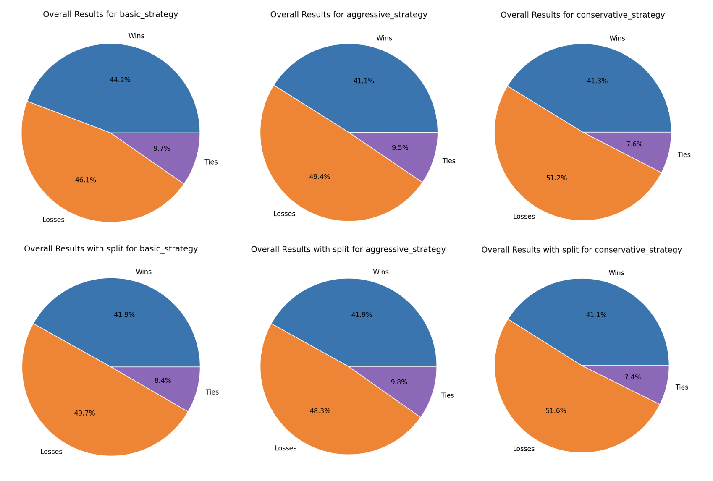
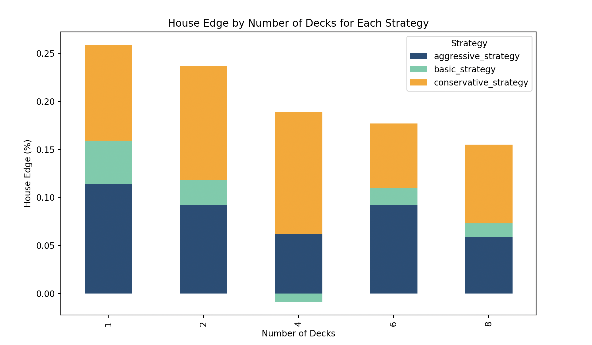

# **Blackjack Monte Carlo Simulation** 

This project presents a simulation of the game of Blackjack with the use of the Monte Carlo method. The main objective is to analyse the impact of different strategies and the number of decks on the game's outcomes and house edge (built-in profit margin that a casino has over players). These results help demonstrate how different strategies perform and how the number of decks impacts the house edge.

## **Table of Contents**

1. [Getting started](#⚡getting-started)

2. [Project Structure](#⚙️-project-structure)

3. [Methodology](#💡-methodology)

4. [How to Run](#🏃‍♂️-how-to-run)

5. [Limitations](#⚠️-limitations)

6. [Future Scope](#🎯-future-scope)

7. [Conclusion](#📖-conclusion)

8. [References](#📚-references)

9. [Contributing](#👍-contributing)

## **⚡Getting started** 

**Prerequisites:**

Ensure you have the following dependencies installed:

* Python 3.x  
* Matplotlib  
* Pandas  
* NumPy

**Installation:**

Clone the repository and navigate to the project directory. You can install the required packages using pip.

```bash
 pip install matplotlib pandas numpy
```

## **⚙️ Project Structure** 

* `main.py`: The primary script to simulate the Blackjack game. It generates results and visualisations for different strategies.  
* `blackjack_with_split.py`: An extended version of `main.py`, which includes an additional action, the split.  The split action allows players to separate a pair of cards of the same rank into two hands.  
* `test_player_split.py`: Utilise unit testing to ensure that the split actions functions properly.  
* `simulation_results_detailed.csv`: Contains detailed results of the simulations.  
* Images:  
  * `aggressive_strategy_results.png`  
  * `basic_strategy_results.png`  
  * `conservative_strategy_results.png`  
  * `house_edge_comparison.png`

## **💡 Methodology** 

This project utilises the Monte Carlo method to simulate thousands of blackjack hands under different strategies and deck conditions.Here are the key steps involved in the methodology:

**Game Setup:**

* Creating a Deck class to represent the deck of cards and handle card draws and shuffling.   
*  Defining a Player class and a Dealer class to handle the player and dealer actions, respectively.   
* Implementing the game logic in the Game class, including dealing cards, player actions (hit, stand, split), and determining the winner. 

**Defining Strategies:**

The primary strategies analysed are:

* **Aggressive Strategy**: The player takes more risks to maximise wins.  
  * **Hit** if your hand is 15 or less  
  * **Hit** if you have 16-17 and the dealer's upcard is 9, 10, or Ace  
  * **Stand** if you have 18 or more, regardless of the dealer's upcard  
      
* **Basic Strategy**: The player follows standard Blackjack guidelines.  
  * **Hit** if your hand is 11 or less  
  * **Hit** if you have 12-16 and the dealer's upcard is 7 or higher  
  * **Stand** if you have 12-16 and the dealer's upcard is 2-6  
  * **Stand** if you have 17 or more

* **Conservative Strategy**: The player minimises risk to reduce losses.  
  * **Hit** if your hand is 11 or less  
  * **Hit** if you have 12 and the dealer's upcard is is 7 or higher  
  * **Stand** if you have 12 and the dealer's upcard is 6 or less  
  * **Stand** if your hand is 13 or higher, regardless of the dealer's upcard


**Simulations Runs:**  
Running the simulation for a specified number of trials and number of decks, collecting the results (wins, losses, ties, scores).

**Analysis:**  
Analyse the simulation results to compare the effectiveness of different strategies and how the number of decks affects the game outcomes and house edge.

**Generating:**

* **CSV File**  
  The simulation generates a CSV file containing detailed results.  
  (`simulation_results_detailed.csv`)  
    
* **Visualizations**  
  The simulation saves plots as PNG files in the current directory.  
1. **Wins, Losses, and Ties by Number of Decks**: These plots show the outcomes for each strategy over varying numbers of decks.  
   1. `aggressive_strategy_results.png`  
   2. `basic_strategy_results.png`  
   3. `conservative_strategy_results.png`  
2. **House Edge by Number of Decks for All Strategies**: This plot compares the house edge across different strategies and amount of decks.  
   1. `house_edge_comparison.png`

      

## **📊 Visual Insights (from our analysis)**

**Pie charts for each strategy, summarising the wins, losses, and ties across all decks:**



**Bar Chart for House Edge by Number of Deck:**



## 

## **🏃‍♂️ How to Run**

**Running the Main Simulation:**

To run the primary Blackjack simulation and generate results:

```python
 main.py
```

**Running the Simulation with Split Action:**

To run the extended simulation that includes the 'split' action:

```python
 blackjack_with_split.py
```

**Testing the Split Action:**

Notes \- The split action in \`blackjack\_with\_split.py\` is a rare event, hence the separate test file to verify its functionality.

To test if the 'split' action is functioning correctly:

```python
 -m unittest test_player_split.py
```

## 

## **⚠️ Limitations** 

The primary limitations of this project include:

* **Model Assumptions**: The simulation assumes perfect adherence to each strategy without human error or changes in strategy mid-game.  
* **Simplified Rules**: The simulation assumes a single player playing against the dealer, without considering multiple players or different betting strategies.   
* **Randomness**: Monte Carlo simulations rely on randomness, which means results can vary slightly between runs. Large numbers of iterations are used to mitigate this effect.


## **🎯 Future Scope** 

1. Implement more advanced strategies.    
2. Add a user interface for interactive play.   
3. Extend the analysis to include more complex betting systems.

## 

## **📖 Conclusion**  

* Simulates Blackjack strategies including basic, aggressive, and conservative.  
* Analyses outcomes as a function of the number of decks.  
* Includes extended simulation with the 'split' action.  
* Visualisations of win/loss/tie ratios and house edges.  
* Detailed results output to CSV for further analysis.

## **📚 References** 

\[1\]  [Roger R Baldwin, Wilbert E Cantey, Herbert Maisel, and James P Mc-Dermott. The optimum strategy in blackjack. Journal of the American Statistical Association, 51(275):429–439, 1956\.](https://www.tandfonline.com/doi/abs/10.1080/01621459.1956.10501334)

\[2\]  [Nicholas Metropolis et al. The beginning of the monte carlo method. Los Alamos Science, 15(584):125–130, 1987\.](https://www.webpages.uidaho.edu/\~stevel/565/literature/The%20Beginning%20of%20Monte%20Carlo%20Method.pdf)

\[3\]  [Towards Data Science. (n.d.). The Statistics of Blackjack.](https://towardsdatascience.com/the-statistics-of-blackjack-e3b5fc29e67d)

\[4\]  [Towards Data Science. (n.d) Python Blackjack Simulator.](https://towardsdatascience.com/python-blackjack-simulator-61b591ffb971)

\[5\]  [Towards Data Science. (n.d) Creating And Hosting Blackjack Simulator Using Python and Streamlit](https://python.plainenglish.io/a-lesson-in-blackjack-and-python-hosted-by-streamlit-b927147bec8d)

## 

## **👍 Contributing** 

Contributions are welcome\! Please fork this repository and submit pull requests. For major changes, open an issue first to discuss what you would like to change.

